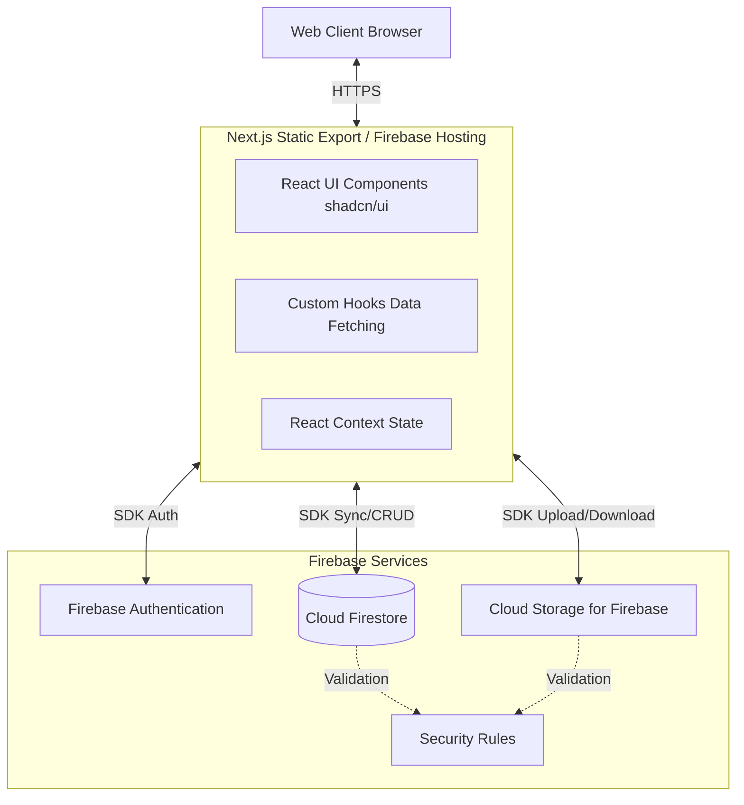

# システムアーキテクチャ設計書

## 1. プロジェクト概要
aina-lifeは、ペットの日常を写真付きで記録・共有できるモダンな生活日記アプリケーションです。本設計書では、システムの全体的な技術構成とアーキテクチャの基本方針を定義します。

## 2. システム構成 (Architecture Overview)
本システムは、サーバー運用やAPI開発のコストを最小化するため、**BaaS（Backend as a Service）**であるFirebaseを活用した**サーバーレスアーキテクチャ**を採用しています。

### 2.1 全体構成図

### 2.2 技術スタック
| アーキテクチャ層         | 採用技術                                       | 選定理由                                                                                                   |
| ------------------------ | ---------------------------------------------- | ---------------------------------------------------------------------------------------------------------- |
| **フロントエンド**       | Next.js 16 (React 18), TypeScript              | App Router を利用したコンポーネント指向の開発と、型の安全性確保。                                          |
| **ビルド・ホスティング** | Next.js Static Export (out/), Firebase Hosting | SSG (Static Site Generation) による高速な初期ロードと、シンプルな CDN 配信。                               |
| **スタイリング**         | Tailwind CSS v4, shadcn/ui                     | ユーティリティファーストでの高速なスタイリングと、アクセシビリティ担保された高品位な UI コンポーネント群。 |
| **データベース**         | Cloud Firestore (NoSQL)                        | リアルタイム同期機能と、スキーマレスなドキュメント志向による柔軟なデータモデリング。                       |
| **認証**                 | Firebase Authentication (Google 認証)          | 簡単な導入で堅牢なソーシャルログインを実現。                                                               |
| **ストレージ**           | Cloud Storage for Firebase                     | 日記に添付する画像ファイル等の大容量ファイルの保存・配信。                                                 |

## 3. インフラストラクチャ基本設計方針

### 3.1 サーバーレス＆エッジ・コンピューティング
* アプリケーションは静的ファイルとしてビルドされ（`next build`）、Firebase Hosting のグローバル CDN 経由でエッジ配信されます。サーバー側の Node.js プロセスは不要です。
* 全てのビジネスロジック・データ操作は、クライアントサイドの Firebase SDK を通じて直接バックエンドへリクエストされます。

### 3.2 セキュリティロジックの担保
* サーバーサイドのバックエンド API が存在しない構成のため、**Firestore Security Rules** および **Storage Security Rules** がアプリケーションのセキュリティゲートウェイとして機能します。
* 認証状態（`request.auth`）と、データ構造に基づく権限検証をここで行うことで、不正な読み書きをブロックします。（詳細は `05_security_design.md` を参照）

### 3.3 パフォーマンスとスケーラビリティ
* **リアルタイム同期**: Firestore の `onSnapshot` リスナーを利用し、データ変更を即座に UI に反映。
* **データ集約による最適化**: タイムラインやカレンダー表示など、大量のドキュメントを読み込む箇所においては、「月次集約（`entry_months`）」や「年次集約（`weight_years`）」ドキュメントを設け、Firestore の読み込み回数とトラフィックを最小限に抑える設計としています。
