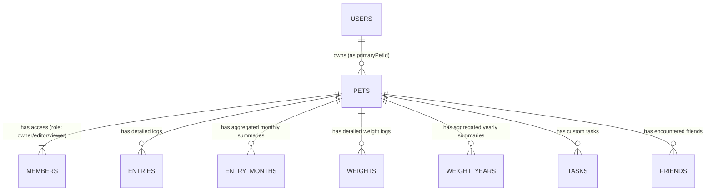

# データベース（Firestore）設計書

## 1. データベース設計方針
本システムは NoSQL データベースである **Cloud Firestore** を採用しています。データモデルは「ペット」を中心としたマルチテナント型の階層構造（ドキュメント - サブコレクション構造）としており、データのカプセル化とアクセス制御（ペットごとの共有機能）を容易にしています。

また、頻繁に読み込まれる「カレンダー表示」や「グラフ表示」のパフォーマンスを向上・コスト（読み取り回数）を削減するため、**集約用コレクション（月別・年別サマリー）**を導入する非正規化の手法を取り入れています。

## 2. 全体リレーション構造（ERライク図）

## 3. コレクション詳細定義

凡例:
* `PK`: ドキュメントID (Firestore自動生成または特定フォーマット)
* `Ref`: 他のドキュメントへの参照（UID など）

### 3.1 ルートコレクション

#### `users` コレクション
ユーザー個人の基本情報やアプリ固有の設定を保持します。

| フィールド名   | 型           | 説明                                        |
| -------------- | ------------ | ------------------------------------------- |
| `uid`          | String (PK)  | Firebase Auth の UID と一致                 |
| `email`        | String       | メールアドレス                              |
| `displayName`  | String       | 表示名                                      |
| `nickname`     | String       | ニックネーム（任意）                        |
| `avatarUrl`    | String       | プロフィール画像 URL                        |
| `primaryPetId` | String (Ref) | 最後に選択/アクティブなペットの ID          |
| `settings`     | Map          | アプリ設定 (テーマカラー、時間表示形式など) |
| `createdAt`    | Timestamp    | 作成日時                                    |
| `updatedAt`    | Timestamp    | 更新日時                                    |

#### `pets` コレクション
ペット本体のプロファイル情報を保持します。共有機能におけるアクセス制御のルートノードとなります。

| フィールド名        | 型            | 説明                              |
| ------------------- | ------------- | --------------------------------- |
| `id`                | String (PK)   | ペットの固有 ID                   |
| `name`              | String        | ペットの名前                      |
| `species` / `breed` | String        | 種類（犬、猫など）/ 品種          |
| `gender`            | String        | 性別 (male/female/other)          |
| `birthday`          | String        | 誕生日（YYYY-MM-DD等）            |
| `avatarUrl`         | String        | アバター画像 URL                  |
| `memberUids`        | Array[String] | 参照高速化用のメンバー UID リスト |
| `createdBy`         | String (Ref)  | 作成者 UID                        |

---

### 3.2 サブコレクション (パス: `pets/{petId}/*`)

全てのログや設定データは、対象となる特定のペット（`petId`）のサブコレクションとして保存されます。

#### `members` (共有メンバー)
ペットのデータに対するアクセス権を持つユーザーのリストです。

| フィールド名  | 型           | 説明                                       |
| ------------- | ------------ | ------------------------------------------ |
| `id`          | String (PK)  | メンバー管理用 ID                          |
| `userId`      | String (Ref) | ユーザーの UID                             |
| `inviteEmail` | String       | 招待先メールアドレス                       |
| `role`        | String       | 権限レベル (`owner`, `editor`, `viewer`)   |
| `status`      | String       | 招待状態 (`pending`, `active`, `declined`) |

#### `entries` (日記詳細)
日々の出来事、お世話、通院記録などの詳細データです。

| フィールド名       | 型            | 説明                                   |
| ------------------ | ------------- | -------------------------------------- |
| `id`               | String (PK)   | エントリー ID                          |
| `type`             | String        | エントリー種別 (`diary` / `schedule`)  |
| `timeType`         | String        | 時間指定種別 (`point` / `range`)       |
| `date` / `endDate` | Timestamp     | 発生日時 / 終了日時                    |
| `title` / `body`   | String        | タイトル / 本文詳細                    |
| `tags`             | Array[String] | タグ（「ごはん」「散歩」「通院」など） |
| `imageUrls`        | Array[String] | 添付画像の Storage URL リスト          |
| `isCompleted`      | Boolean       | （予定の場合の）完了フラグ             |

#### `entry_months` (月次集約データ - ★パフォーマンス最適化)
カレンダーやタイムラインで「特定の月」のデータを一覧表示する際、`entries` から数十件を個別に読むのを防ぐための集約ドキュメントです。

| フィールド名 | 型          | 説明                                                                       |
| ------------ | ----------- | -------------------------------------------------------------------------- |
| `id`         | String (PK) | 月の識別子（例: `2024-03`）                                                |
| `entries`    | Array[Map]  | 該当年月の `EntrySummary`（画像は1枚目のみ、本文など一部フィールド）の配列 |

#### `weight_years` (年次集約体重 - ★パフォーマンス最適化)
体重のグラフ描画に必要な「1年分」の推移データを1ドキュメントとして保持します。

| フィールド名 | 型          | 説明                                           |
| ------------ | ----------- | ---------------------------------------------- |
| `id`         | String (PK) | 年の識別子（例: `2024`）                       |
| `year`       | Number      | 対象の年                                       |
| `weights`    | Array[Map]  | 体重の時系列配列（日付、値、単位 `kg/g` など） |

#### `friends` (お散歩友達)
散歩中などに出会った他のペットの情報を保持します。

| フィールド名     | 型            | 説明                   |
| ---------------- | ------------- | ---------------------- |
| `id`             | String (PK)   | 友達ペットの ID        |
| `name` / `breed` | String        | 名前 / 犬種など        |
| `images`         | Array[String] | 写真 URL               |
| `metAt`          | Timestamp     | 初回または最終遭遇日時 |

## 4. 共通フィールド（監査カラム）
主要なコレクションには、更新トラッキングとアクセス制御（Security Rules）のために以下の共通監査フィールドが付与されます。

* `createdAt`: Timestamp (作成日時)
* `updatedAt`: Timestamp (最終更新日時)
* `createdBy`: String (作成者UID)
* `updatedBy`: String (最終更新者UID)
