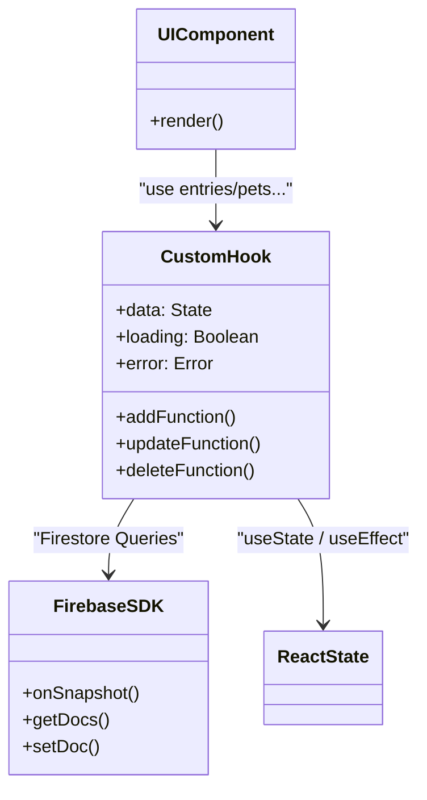

# API・状態管理・データフロー設計書

## 1. 概要
aina-life は、Firebase SDK を利用してバックエンド（Firestore, Storage）と直接通信を行うフロントエンド完結（サーバーレス）構成です。そのため、従来の RESTful/GraphQL のようなサーバーエンドポイントは存在せず、**React カスタムフック**内で Firebase クエリを実行する**Data Fetching と State Management**の設計が重要となります。

## 2. 状態管理（State Management）の方針

### 2.1 Гローバル状態 (Global State)
アプリケーション全体、あるいは複数の画面間で共有すべき情報は **React Context** を用いて提供します。

| Context 名        | 役割と提供内容                                                                                                                                   | 依存関係                                 |
| ----------------- | ------------------------------------------------------------------------------------------------------------------------------------------------ | ---------------------------------------- |
| **`AuthContext`** | - 現在ログイン中のユーザーオブジェクト (`User` 型) - `Firebase Auth` の `user` 情報 - 認証中フラグ（ローディング状態）                     | Firebase Auth, Firestore `users`         |
| **`PetContext`**  | - ユーザーが現在選択している対象のペット (`currentPet`) - 全ての所有・共有ペットのリスト - そのペットに対するユーザーの権限レベル (`role`) | AuthContext, Firestore `pets`, `members` |

#### `AuthContext` と `PetContext` のカスケード
認証が完了した `AuthContext` の `uid` を起点に、`PetContext` は、該当ユーザーがアクセス権を持つ `pets` を購読開始します。そのリストの中で前回選択していた（または新しく作成した）ペットを「現在の操作対象」として全体に通知します。

### 2.2 ローカル・ビジネス状態 (Data Fetching Hooks)
データの CRUD（作成・読み取り・更新・削除）や、画面個別のフェッチは、すべてディレクトリ `src/hooks/` 配下の**カスタムフック**にカプセル化されています。

## 3. 主要なカスタムフックとデータ連携

機能単位ごとに、Firebase へのアクセスやローカルキャッシュ・状態管理を行うために以下のフックが定義されています。

### 3.1 読み取り (Data Fetching / Subscribe)

| フック名     | 取得先 / 主要機能                                 | キャッシュ/リアルタイム                                              |
| ------------ | ------------------------------------------------- | -------------------------------------------------------------------- |
| `useEntries` | `pets/{id}/entries`   `pets/{id}/entry_months` | - 月別サマリーを利用した高速表示 - Snapshotリスナーによる即時反映 |
| `useWeights` | `pets/{id}/weights`   `pets/{id}/weight_years` | - グラフ描画データの一括取得                                         |
| `useFriends` | `pets/{id}/friends`                               | - 散歩友達のリスト管理                                               |
| `useMembers` | `pets/{id}/members`                               | - ペット共有メンバー・権限の一覧                                     |

### 3.2 更新・作成 (Mutations)

| フック名         | 保存操作ロジック    | その他の処理                                                                                              |
| ---------------- | ------------------- | --------------------------------------------------------------------------------------------------------- |
| `useEntry`       | `entries` 作成/更新 | Storageへの画像アップロード（`useImageUpload`）連携と、集約データ（`entry_months`）への差分書き込みを内包 |
| `usePets`        | `pets` 作成/更新    | プロフィール画像アップロード、および登録者を Owner として `members` に初期登録                            |
| `useImageUpload` | Firebase Storage    | リサイズ（`cropImage`）、MIME判別、パス生成                                                               |

## 4. データフロー（例：日記の作成）

日記作成時の典型的なデータの流れは以下の通りです。

1. **ユーザー操作**: UI上（例: `/entry/new`）でテキストの入力や画像のドラッグ＆ドロップを行う。
2. **アップロード**: `useImageUpload` を呼び出し、Storage に画像を順次保存し、各 URL を取得。
3. **データ形成**: 入力データと画像URLから、Firestoreの `Entry` 型データを作成し、監査フィールド（`createdAt`, `createdBy`）を付与。
4. **データベース保存**: `setDoc()` 関数により、詳細データ `pets/{id}/entries/{entryId}` へ書き込み。
5. **集約データの更新**: トランザクションまたは同時更新にて、カレンダー用集約コレクション `pets/{id}/entry_months/{yyyy-mm}` 内の配列データにもサマリーを追記 (`arrayUnion` 相当の更新)。
6. **UI反映**: 先述の `useEntries` の `onSnapshot` リスナーがローカルの変更を即座に検知し、カレンダー一覧などが再描画される。（Optimistic UI相当）
